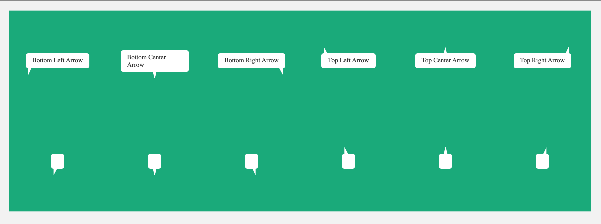

# TMH Speech Bubble

This is speech bubble library.



## Basic Usage

### CSS
```html
<link rel="stylesheet" href="tmh-speech-bubble.css">
```
### HTML
```html
<i class="speech-bubble" data-arrow="bottom-left">Bottom Left Arrow</i>

<i class="speech-bubble" data-arrow="bottom-center">Bottom Center Arrow</i>

<i class="speech-bubble" data-arrow="bottom-right">Bottom Right Arrow</i>
```

## Variable defaults
```scss
// _variable.scss

// colors
$bubble-bg-color: #fff;
$bubble-color: #333;
// fonts
$bubble-font-size: 13px;
// position
$bubble-position-left: 5px;
$bubble-position-right: 5px;
// width and height of speech bubble
$bubble-max-width: 135px;
```